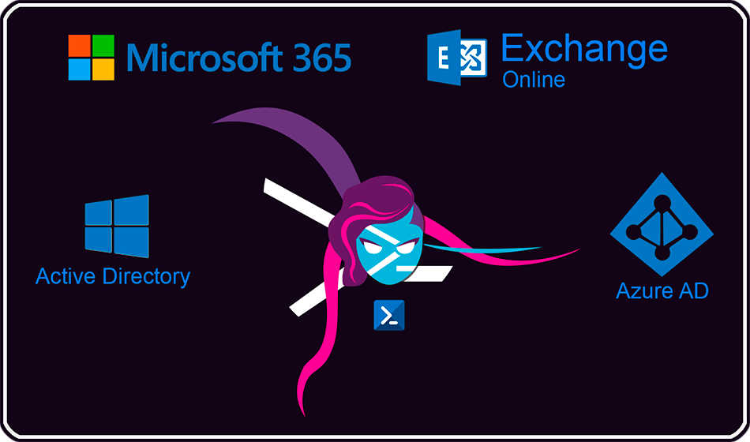

<h1 align="center">PowerShell Scripts: Active Directory, Azure AD, Office 365 & Exchange Online</h1>

  

<h1>Table of contents</h1>

- [`01.Assign-Licenses-To-UserAccounts-O365`](#01assign-licenses-to-useraccounts-o365)
- [`02.Manage-Permissions-RecipientsMailbox-EXO`](#02manage-permissions-recipientsmailbox-exo)
- [`03.Create-ADUsers`](#03create-adusers)
- [`04.Create-ADGroups`](#04create-adgroups)
- [`05.Get-Inactive-ADCompUsers-LastLogon`](#05get-inactive-adcompusers-lastlogon)
- [`06.Get-Move-ADComputers`](#06get-move-adcomputers)
- [`07.Get-DNS-Records-Duplicate-IPs`](#07get-dns-records-duplicate-ips)
- [`08.Create-Recursive-Directories`](#08create-recursive-directories)
- [`09.Get-ADUsers-LastLogon`](#09get-adusers-lastlogon)
- [`10.Change-Attributes-ADUsers`](#10change-attributes-adusers)
- [`11.Manage-LocalUsers-Accounts`](#11manage-localusers-accounts)
- [`12.Migrate-UserProfile`](#12migrate-userprofile)
- [`13.Encode-Password-Batchfile`](#13encode-password-batchfile)
- [`14.Get-ADGroups-Inherited`](#14get-adgroups-inherited)
- [`15.Get-Services-RemoteHost`](#15get-services-remotehost)
- [`16.Manage-ADResourcesShared`](#16manage-adresourcesshared)
- [`17.Join-ComputerToDomain`](#17join-computertodomain)
- [`18.CopyUsers-ADGroup-SourceToDestination`](#18copyusers-adgroup-sourcetodestination)
- [`19.ReverseSID-ADUser`](#19reversesid-aduser)
- [`20.Full-Export-ADObjects-MultipleDomains`](#20full-export-adobjects-multipledomains)
- [`21.Move-ItemExtension-RecursivePath`](#21move-itemextension-recursivepath)
- [`22.WindowsDefender-Status`](#22windowsdefender-status)
- [`23.AdminLocal-Config`](#23adminlocal-config)
- [`24.Remote-Code-Execution`](#24remote-code-execution)
- [`25.Get-Properties-By-Email`](#25get-properties-by-email)
- [`26.Get-ADUsers-LastWhenCreated`](#26get-adusers-lastwhencreated)
- [`27.Get-MicrosoftUpdatesInstalled`](#27get-microsoftupdatesinstalled)
- [`28.Get-IP-HostName-AD-DNS`](#28get-ip-hostname-ad-dns)
- [`29.Add-UserTemporary-GroupMembership`](#29add-usertemporary-groupmembership)
- [`30.Get-All-DCs-FSMO-Roles-Domain`](#30get-all-dcs-fsmo-roles-domain)
- [`31.TS-Loss-TrustRelationship-Reset-DomainComputer`](#31ts-loss-trustrelationship-reset-domaincomputer)
- [`32.Migrate-ADUsers-To-NewDomain`](#32migrate-adusers-to-newdomain)
- [`33.Gathering-Info-MSOnline-ExchangeOnline`](#33gathering-info-msonline-exchangeonline)
- [`34.Get-ADComputersInactive`](#34get-adcomputersinactive)

---

#### `01.Assign-Licenses-To-UserAccounts-O365`
- Get or Assign licenses to user accounts with Office 365 PowerShell script from csv file to import.

#### `02.Manage-Permissions-RecipientsMailbox-EXO`
- Manage permissions for recipients in Exchange Online. Add multiple users to a shared mailbox.

#### `03.Create-ADUsers`
- Create new users in Active Directory with PowerShell script from csv file to import.

#### `04.Create-ADGroups`
- Create new groups in Active Directory with PowerShell script from csv file to import.

#### `05.Get-Inactive-ADCompUsers-LastLogon`
- *Get-Inactive-ADCompUsers.ps1*: Get objects users and computers inactive in Active Directory with PowerShell script and export to a csv file.
- *Get-Inactivity-ADUsersLastLogon.ps1*: Get the last login of Active Directory users (set the $DaysInactive variable). Search only for enabled AD users and export the output to a csv file.

#### `06.Get-Move-ADComputers`
- Get or move computers objects in Active Directory with PowerShell script from csv file to import.

#### `07.Get-DNS-Records-Duplicate-IPs`
- Get hostname (DNS Records) of active computers in Active Directory and associated duplicate IPs.

#### `08.Create-Recursive-Directories`
- Create batch directories from a csv file recursively in local or shared directories.

#### `09.Get-ADUsers-LastLogon`
- Get the last login of all Active Directory users by traversing this query on all available domain controllers, thus ensuring the effectiveness of the LastLogon TimeStamp. Export the output to a .csv file for work later date filtering.

#### `10.Change-Attributes-ADUsers`
- Modify Active Directory User Account Attributes, loading a list of users from a CSV file.

#### `11.Manage-LocalUsers-Accounts`
- Sample functions for managing Windows local user accounts. Example files of password encryption, to avoid parameterize a password in plain text in a PowerShell script. (function to check script execution privileges "*CheckPrivileges*").

#### `12.Migrate-UserProfile`
- Migrate/Copy the most relevant directories from a local or domain user profile to a new computer using ROBOCOPY tool.

#### `13.Encode-Password-Batchfile`
- Encode Password in batch file (.bat). A possible way to encode passwords in a batch file and not display in plain text passwords.

#### `14.Get-ADGroups-Inherited`
- Get up to 3 levels of nested inheritances in Active Directory groups. (String 1.2.840.113556.1.4.1941 -> LDAP_MATCHING_RULE_IN_CHAIN: Get inherited memebership groups).

#### `15.Get-Services-RemoteHost`
- Get report of all local services and users of remote server computers.

#### `16.Manage-ADResourcesShared`
- Management of common shared resources, assignment of resource permissions to AD users. (Makes use of the *NTFSSecurity* module).

#### `17.Join-ComputerToDomain`
- Set computer name and join computer to AD domain.

#### `18.CopyUsers-ADGroup-SourceToDestination`
- Copy all users from a source group to a target group in Active Directory.

#### `19.ReverseSID-ADUser`
- Get AD SamAccountName given your SID.

#### `20.Full-Export-ADObjects-MultipleDomains`
- *FullExport-ADObjects.ps1*: Get all objects from all available Active Directory domains and export them in a CSV format (users, groups and computers).
- *FullExport-ADObjects-Output-Excel*: This script is the same as the main FullExport-ADObjects.ps1 script. With the difference that it adds three new optional functions designed for corporate environments and a more visual and customized in format .XLSX final presentation using the MS Excel module.
- *Get-AddFQDN-ADComputers.ps1*: Concatenate attributes Name, Domain and DistinguishedName to establish a FQDN (DNSHostName) for computers objects (non-Windows), add a new column to an existing CSV file and then export it all in a single CSV file.

#### `21.Move-ItemExtension-RecursivePath`
- Recursively move files of a given extension from subdirectories to a target root directory.

#### `22.WindowsDefender-Status`
- Check the status of the Windows Defender service and components and disable it for security testing to prevent threat detection.

#### `23.AdminLocal-Config`
- Disable the default local administrator and create a new user that is part of the local administrators group.

#### `24.Remote-Code-Execution`
- Remote Code Execution Options. Execute commands remotely on a Domain Controller using: WMI, WinRM, PowerShell (WMI), PowerShell Remoting.

#### `25.Get-Properties-By-Email`
- Get a AD user properties information from the domain email. And get from an array of emails.

#### `26.Get-ADUsers-LastWhenCreated`
- Get the AD users created in the last 30 days and sorted by creation date. We can filter by name with findstr for a more specific result.
- Get the all AD users sorted by creation date of a specific OU.

#### `27.Get-MicrosoftUpdatesInstalled`
- With this script get a list of all Microsoft Updates. Shows all Microsoft Updates, not just Windows Updates like Get-HotFix.

#### `28.Get-IP-HostName-AD-DNS`
- *Get-IP-HostName-AD.ps1*: Do it with the Get-ADComputer cmdlet to get the IP address from the Active Directory computer object attributes. Use the ActiveDirectory module.
- *Get-IP-HostName-DNS.ps1*: Do this with the Get-DnsServerResourceRecord cmdlet to get the IP address via the type A record associated with the DNS hostname domain. Use the DnsServer module.

#### `29.Add-UserTemporary-GroupMembership`
- *Add-UserTempGroupMembership*: This feature is called Temporary Group Membership (Time Based). This feature can be used when you need to temporarily grant a user some authority based on AD security group membership. After the specified time has elapsed, the user will be automatically removed from the security group (without administrator intervention).

#### `30.Get-All-DCs-FSMO-Roles-Domain`
- Get FSMO roles from the Active Directory domain (Flexible Single Master Operation).
- Get all Domain Controllers the domain.

#### `31.TS-Loss-TrustRelationship-Reset-DomainComputer`
- Troubleshooting - Trust relationship between this workstation and the primary domain failed.

#### `32.Migrate-ADUsers-To-NewDomain`
- Migrate a list of users from an old domain to a new domain Active Directory.

#### `33.Gathering-Info-MSOnline-ExchangeOnline`
- Collection of use cases, mainly for gathering information using the *MSOnline* modules of Office 365 and *ExchangeOnlineManagement* of Exchange Online.

#### `34.Get-ADComputersInactive`
- A fast and easy way to detect inactive Active Directory computers based mainly on two properties: *lastlogondate, PasswordLastSet*.